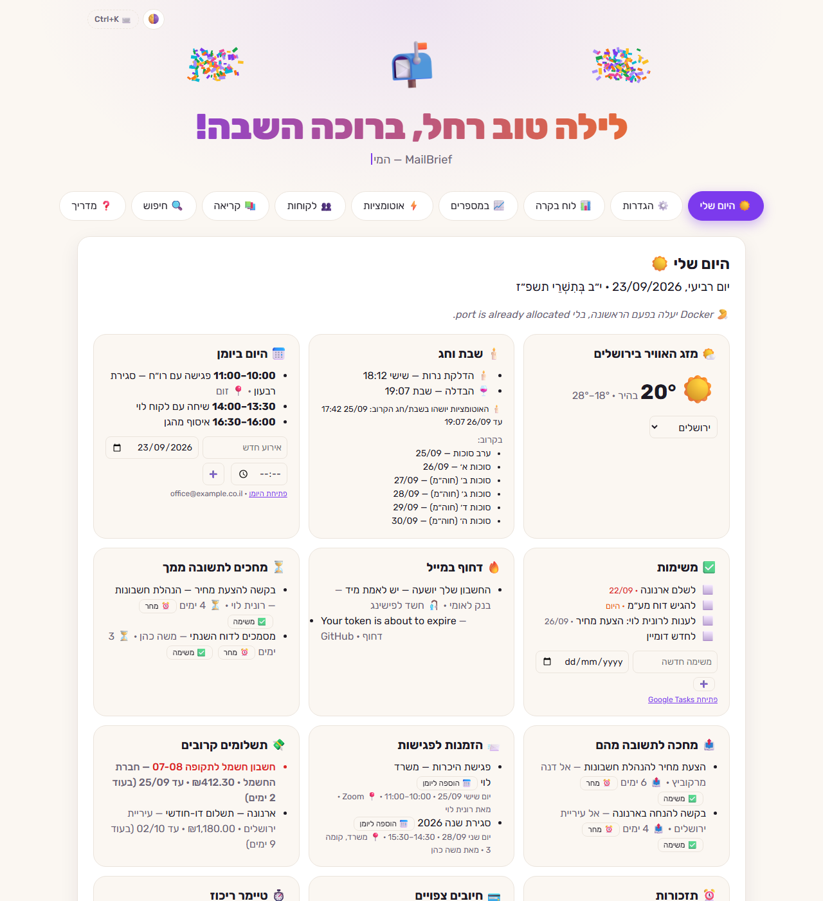
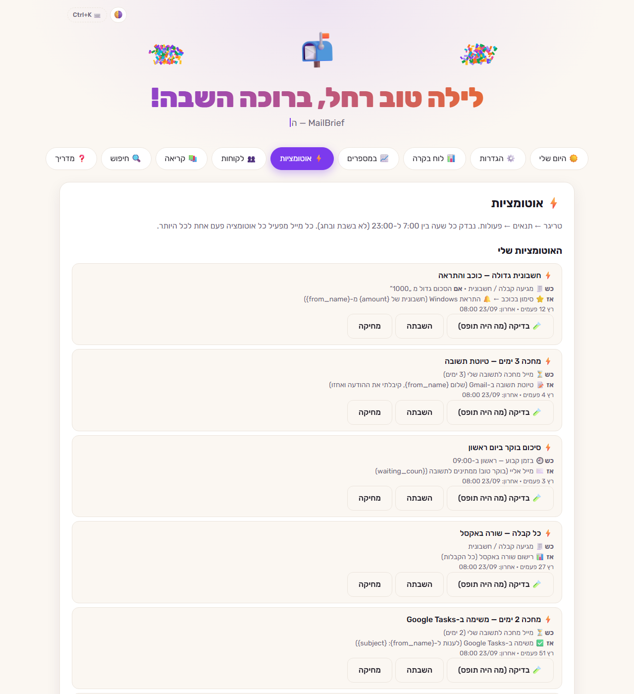
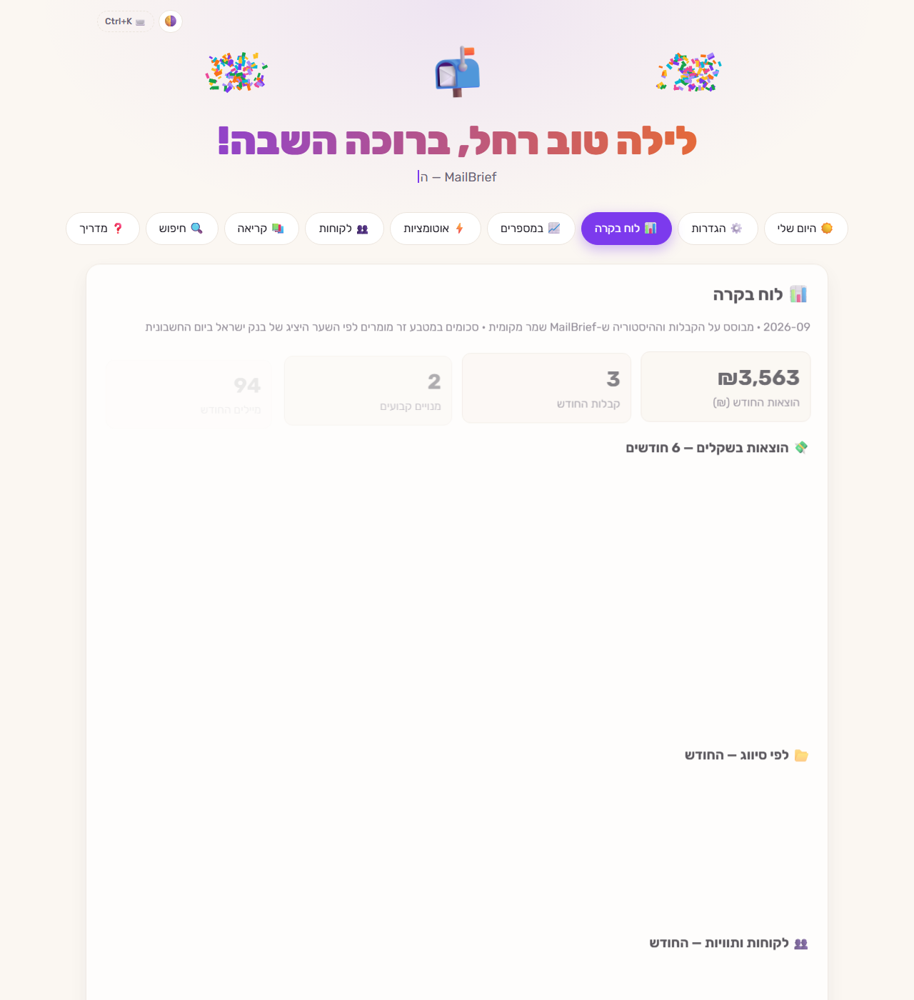

<div align="center">


# MailBrief

**עוזר מייל מקומי לכל תיבת דואר — בלי AI, בלי ענן, בלי שהמייל שלך יוצא מהמחשב.**

תדריך שבועי · „היום שלי” · אוטומציות · קבלות ואקסל · זיהוי פישינג · שבת וחג


`winget install mailbrief` · [⬇️ הורדה (MailBrief.exe)](https://github.com/ayal408/mailbrief/releases/latest) · [English](#english)

</div>

---

## מה זה

MailBrief רץ על המחשב שלך ומתחבר לתיבות הדואר שלך (Gmail, Microsoft, או כל שרת IMAP).
הוא ממיין, מתריע, רושם קבלות ומריץ אוטומציות — לפי כללים פשוטים שאפשר לראות ולשנות, בלי בינה מלאכותית ובלי שרת חיצוני.
כל הנתונים נשמרים בתיקייה אחת על המחשב, והסיסמאות וההרשאות מוצפנות עם ההצפנה של Windows.

<p align="center">
  
  
</p>

## יכולות

| | |
|---|---|
| 📬 **תדריך שבועי** | כל יום ראשון: דחוף, מחכים לתשובה ממך, קבלות, אבטחה, ניוזלטרים — בדוח אחד בעברית |
| ☀️ **היום שלי** | נפתח כשנכנסים למחשב: יומן ומשימות, מזג אוויר, זמני שבת, תשלומים, הזמנות לפגישות, טיימר ריכוז ופתקים |
| 🔎 **30 הימים שלך** | מיד אחרי החיבור: כמה עולים המנויים בחודש, אילו ניוזלטרים לבטל בלחיצה, ומי מחכה לתשובה |
| ✉️ **סיכום יומי במייל** | כל בוקר (לא בשבת ובחג) — מה דחוף, מה ביומן ומי מחכה, נוח לקריאה בטלפון |
| 📅 **Google Calendar ו-Tasks** | אירועים ומשימות ב„היום שלי”, הזמנות לפגישות ליומן בלחיצה, ופעולות באוטומציות |
| 📤 **מחכה לתשובה מהם** | שיחות שפתחת ואף אחד לא ענה — עם תזכורת או משימה בלחיצה |
| ⚡ **אוטומציות** | כש___ ← אם___ ← אז___: תווית, העברה, טיוטת תשובה, תשובה אוטומטית, Webhook, אקסל, תזכורת |
| 🧾 **קבלות ואקסל** | שמירת ה-PDF לפי חודש, אקסל חודשי מוכן לרו״ח, שער יציג של בנק ישראל, זיהוי חיוב כפול |
| 💳 **מנויים ותשלומים** | זיהוי חיובים קבועים, תאריכי „לתשלום עד” והתראה יומיים לפני |
| 👥 **לקוחות** | כרטיס לכל לקוח: מיילים, קבלות, ממתינים, הורדת כל הקבצים |
| 🎣 **זיהוי פישינג** | התחזות לבנקים/דואר ישראל, קישורים מטעים, קבצים מסוכנים — עם הסבר למה |
| 📝 **תבניות וחופשה** | טיוטת תשובה ב-Gmail בלחיצה, ומענה חופשה — פעם אחת לכל אדם |
| 🗄️ **ארכיון מקומי** | קבלות ומיילים אישיים נשמרים כקבצי ‎.eml עם דף חיפוש שעובד בלי אינטרנט |
| 🔍 **חיפוש** | בכל התיבות יחד, והורדת כל הקבצים המצורפים מהתוצאות |
| 📈 **במספרים** | כמה מייל, מאיפה, באילו שעות, ואחוז התשובות שלך |
| 🕯️ **שבת וחג** | שום אוטומציה לא רצה מהדלקת נרות עד הבדלה (לפי העיר), ומה שנדחה — רץ אחרי |

<p align="center"></p>

## בטיחות ופרטיות

- **מקומי לגמרי** — השרת מאזין רק ל-`127.0.0.1`; אין שרת חיצוני ואין איסוף נתונים.
- **בלי סיסמאות** — התחברות עם Google / Microsoft (OAuth). אפשר לבטל גישה בכל רגע.
- **הצפנה** — הרשאות וסיסמאות מוצפנות עם Windows DPAPI: רק המשתמש שלך במחשב הזה יכול לפענח.
- **לא מוחק כלום** — תיוג, העתקה וארכיון בלבד. כל פעולה שמשנה משהו היא לבחירתך.
- **שליחה זהירה** — תשובות אוטומטיות לא נשלחות לרשימות תפוצה, לרובוטים או לעצמך, ויש מגבלה יומית.
- **קישורים ממיילים** לא נפתחים אלא אם הם HTTPS לאתר ציבורי.

## התקנה

**הכי פשוט — winget** (מובנה ב-Windows 10/11):

```powershell
winget install mailbrief     # התקנה
mailbrief                            # הפעלה (או מתפריט התחל)
winget upgrade mailbrief     # עדכון
```

הנתונים נשמרים ב-`מסמכים\MailBrief` ונשארים גם אחרי עדכון או הסרה.

**או ידנית:** להוריד את `MailBrief.exe` מ-[Releases](https://github.com/ayal408/mailbrief/releases/latest), לשים בתיקייה משלו ולהפעיל
(כאן הנתונים נשמרים ליד הקובץ, ובתוכנה עצמה יופיע כפתור „✨ עדכון עכשיו” כשיש גרסה חדשה).

בפעם הראשונה: שם ולשון פנייה, מה חשוב לך — ואז „חיבור עם Google” (הגדרה חד-פעמית של כ-5 דקות, ההוראות בדף עצמו).
התזמונים (תדריך שבועי, בדיקה כל שעה, „היום שלי” בכניסה) וקיצור בתפריט התחל נרשמים לבד.

> בהורדה ידנית Windows עשוי להציג אזהרת SmartScreen כי הקובץ לא חתום דיגיטלית: „מידע נוסף” ← „הפעל בכל זאת”.
> לפני מחיקת התוכנה אפשר להריץ `MailBrief.exe --uninstall` כדי להסיר את התזמונים.

## הרצה מקוד המקור

```powershell
python main.py            # דף ההגדרות + הסמל ליד השעון
python main.py --run      # התדריך השבועי
python main.py --check    # הבדיקה השעתית
python -m unittest discover -s tests -v
.\build.ps1               # בניית MailBrief.exe
```

אין תלויות בזמן ריצה — ספריית התקן של Python בלבד. לבנייה: `requirements-dev.txt`.

## מבנה הקוד

```
main.py                   נקודת הכניסה (הופך ל-MailBrief.exe)
mailbrief/
├── config.py             נתיבים ומגבלות
├── storage.py, net.py    קבצים, הצפנה, רשת
├── mail/                 IMAP, OAuth, SMTP, מיון, פישינג, תוויות
├── money/                ספר קבלות, שערים, מנויים, אקסל
├── features/             תדריך, התראות, אוטומציות, תשובות, ארכיון, שבת...
├── web/                  הדפים והשרת המקומי
├── tray.py               הסמל ליד השעון
└── cli.py                --run / --check / --today
tests/                    בדיקות אופליין (בלי רשת ובלי תיבת דואר)
```

---

<a id="english"></a>

## English

**MailBrief** is a local, rule-based (no AI) mail assistant for Windows. It connects to Gmail, Microsoft or any IMAP mailbox
and runs entirely on your PC: a weekly Hebrew brief, a "My day" start page, a trigger → conditions → actions automation engine,
receipts saved to monthly Excel workbooks (with Bank of Israel exchange rates and double-charge detection), phishing detection,
reply templates, vacation replies, a searchable offline archive, and client cards. Automations pause automatically on Shabbat and
Jewish holidays, based on your city.

- Standard library only at runtime; OAuth sign-in; secrets encrypted with Windows DPAPI; the web UI listens on `127.0.0.1` only.
- Install: `winget install mailbrief` or download from [Releases](https://github.com/ayal408/mailbrief/releases/latest) · Run from source: `python main.py` · Tests: `python -m unittest discover -s tests`

MIT License · Made by [Ayal](https://github.com/ayal408).
